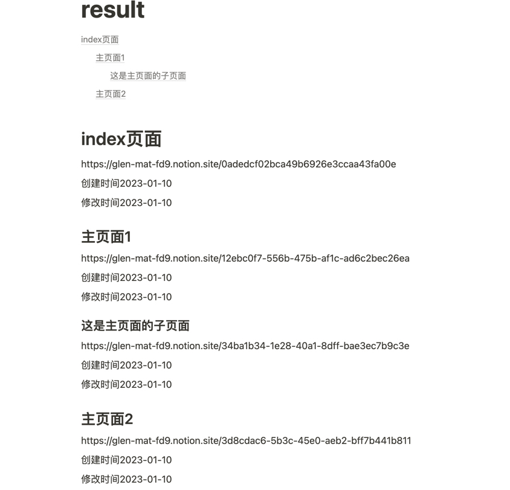

# NoteTree_From_notion
v1.1
## 是什么？
一个由go编写的，通过notion api + json + markdown对notion生成笔记目录，只需要填入token和希望生成“纵深极大”的目录的首页ID，即可生成格式化的目录，方便进行笔记查找
目前仅支持subpage的无限嵌套
v1.0 : 新增根据"文章父子关系"创建文章目录，导出文件为"./result.md"
v1.1 : 新增根据"创建时间"分类并记录文章数量，导出文件为"./calen.md"
##示例效果：
notion页面笔记结构如下：

```
｜index页面
｜_________主页面1（page）
｜_________｜_________这是一些文字笔记，但是不会进入目录...(para)
｜_________｜_________这是主页面的子页面（page）
｜
｜_________主页面2（page）
｜
｜_________这是index页面的一些文字记录，但是不会进入目录(para)
```

这是result.md导入到notion后，并且添加/content目录的样式

## 使用方法
1. 修改main.go中的blockID为你需要进行导出的notion page id。
2. 修改spider.go中token为你的notion api 的secritID。
3. 初始设置为等待50s完成（约400篇文章的时间），如果提示报错，请增加main.go中"waittime"数值。